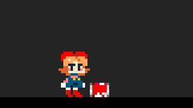
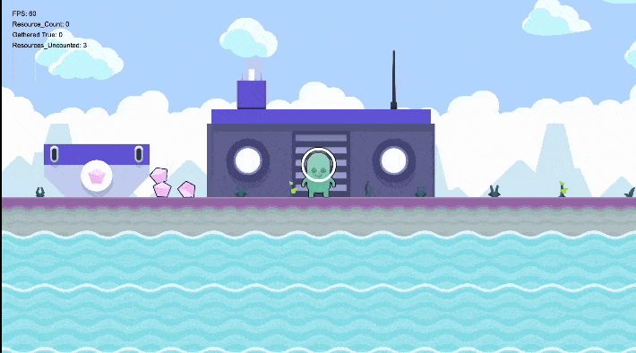

# Câmera

# Definição

Este documento descreve todas as funcionalidades (features) da câmera do jogo, explicando como cada uma funciona e onde se aplica durante a gameplay.

<aside>
💡

**Observação importante:** inimigos que não estão enquadrados pela câmera não podem ser atingidos.

</aside>

---

# Slow Motion


## Descrição

O **Slow Motion** é utilizado em momentos chave da gameplay para intensificar a experiência do jogador. Diferente do **hitstop**, o **slow motion** afeta todo o jogo, deixando-o em câmera lenta.

## Usos

O *slow motion* é ativado quando:

- O jogador morre
- Usa uma habilidade especial
- Derrota o último inimigo de uma rodada

Esses momentos ganham impacto dramático, permitindo que o jogador aprecie cada detalhe da ação. Isso aumenta a tensão e cria cenas memoráveis.

## Parâmetros

- **Escala**: Define a velocidade da câmera lenta. Valor padrão: `1`.
- **Duração**: Tempo total (em segundos) da câmera lenta.
- **Transição**: Tempo de transição entre a velocidade normal e a velocidade reduzida.

## Método

```
slow_motion(Escala, Duração, Transição);
```

---

# Zoom In e Zoom Out (Opcional)

[Camera Zoom image - SokoBunny](https://www.google.com/url?sa=i&url=https%3A%2F%2Fwww.indiedb.com%2Fgames%2Fsokobunny%2Fimages%2Fcamera-zoom&psig=AOvVaw3Yv0wJe7TNDyj01x19R11l&ust=1746902712441000&source=images&cd=vfe&opi=89978449&ved=0CBMQjRxqFwoTCNC4_e6Fl40DFQAAAAAdAAAAABAE)

## Descrição

O controle de zoom é usado para enfatizar momentos importantes:

- **Zoom In**: Ativado quando o jogador recebe dano. Aproxima a câmera, destacando a vulnerabilidade.
- **Zoom Out**: Ativado ao usar uma habilidade de katana. Afasta a câmera, ampliando a visão e reforçando o poder do jogador.

Esse contraste ajuda a modular a intensidade do combate, tornando-o mais dinâmico.

## Parâmetros

- **Zoom_Scale**: Escala do zoom (ex.: `1` = padrão, `2` = dobro do zoom, `0.5` = metade).
- **Damping_Time**: Tempo (em segundos) que a câmera leva para ir de uma escala para outra.

## Exemplo de Uso

```
Zoom_Scale = 2
Damping_Time = 1
set_zoom(Zoom_Scale, Damping_Time);
```

---

# Follow com Damping (X e Y)

## Descrição

A câmera segue o jogador constantemente, com suavização nos eixos X e Y para evitar movimentos bruscos. Esse efeito de **damping** cria transições suaves, contribuindo para uma experiência visual mais agradável e polida.

## Parâmetros

- **Alvo**: Objeto ou personagem a ser seguido.
- **DampingX**: Velocidade de suavização no eixo X.
- **DampingY**: Velocidade de suavização no eixo Y.

## Métodos

```
set_follow(Alvo);
set_damping(DampingX, DampingY);
```

---

# Screen Shake



## Descrição

O **Screen Shake** transmite impacto visual. É ativado em situações como:

- O jogador causar ou receber dano
- Eventos importantes, como o término do tempo

Esse efeito reforça o peso das ações, tornando cada golpe mais satisfatório e visceral.

## Parâmetros

- **Intensidade**: Força da vibração.
- **Tempo**: Duração (em segundos) da vibração.

## Método

```
screen_shake(Intensidade, Tempo);
```

---

# Lookahead



## Descrição

O **Lookahead** antecipa o movimento do jogador, ajustando a posição da câmera para mostrar a direção para onde ele está se movendo ou mirando. Isso é especialmente útil em jogos de ação rápida, como *arena slashers*, melhorando o tempo de reação e a precisão.

## Parâmetro

- **Distância**: Distância máxima do desvio da câmera.

## Método

```
set_lookahead_distance(Distancia);
```