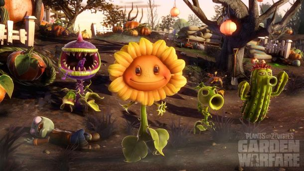

# Ten Pager RMK

# **1. Introdução**

## **Overview**

**Nome do Jogo:** Zombiefactory

**Conceito**: Zombiefactory desafia o jogador a construir e gerenciar uma fábrica em meio a um apocalipse zumbi. Durante o dia, o jogador coleta recursos e aprimora sua base, enquanto à noite se defende de hordas de inimigos utilizando torres automáticas e armamentos diversos. O jogo combina elementos de gestão de recursos, defesa e ação em um ambiente pixel art.

**Objetivo Geral**: Os jogadores devem sobreviver a 20 noites enfrentando diferentes tipos de inimigos. Durante o dia, exploram e coletam recursos para fortalecer sua fábrica e preparação para os ataques noturnos.

**Diferenciais**:

- **Fusão de Tower Defense com Roguelike:** Combina estratégia de defesa com ação frenética em um top-down shooter.
- **Habilidades Ápices:** Evoluções significativas dos power-ups padrões, proporcionando novos efeitos e dinâmicas ao combate.

## **Resumo Executivo**

- **Nome do Jogo:** Zombiefactory
- **Gênero(s):** Gestão de recursos, Sobrevivência, Ação, Tower Defense, Pixel Art.
- **Tags:** Zombies, Fábrica, Armas, Exploração, Ação, Roguelike.
- **Jogadores:** Single Player, Multiplayer Online.
- **Idiomas:** Português, Inglês.
- **Plataformas:** PC (Steam).
- **Público-alvo:** Entusiastas de roguelikes, tower defense e jogos de apocalipse zumbi.
- **Pitch:** Zombiefactory é um jogo de sobrevivência onde o jogador constrói e gerencia uma fábrica, coleta recursos e aprimora defesas para sobreviver a 20 noites contra hordas de zumbis cada vez mais desafiadoras.

## **Inspirações**

**Don't Starve Together**: 

- Exploração e sobrevivência bem implementadas.
- Estética sombria e alinhada com um mundo pós-apocalíptico.

**Plantas vs. Zombies**:

- Ambientação e humor característicos.
- Cenários diversificados, incluindo jardins e cemitérios, semelhantes aos do jogo.

**Bloons TD 5**:

- Exemplo moderno de tower defense.
- Possibilidade de posicionar "torres" estrategicamente para repelir inimigos.

# **2. Descrição**

## **História e Enredo**

**Contexto**: ****Em um futuro distante, o mundo está infestado por zumbis que ameaçam a vida na Terra. Como especialista em sobrevivência seu trabalho é encontrar áreas isoladas e transformá-las em locais seguros. Para isso, você constrói e gerencia uma fábrica que produz itens essenciais para a sobrevivência e torres de defesa para limpar as áreas de zumbis.

**Enredo Principal**: ****Ao chegar a uma nova área, você tem 20 dias para estabelecer uma base segura antes que a infestação atinja um ponto crítico. Começando por um jardim abandonado e depois avançando para um antigo cemitério, cada ambiente traz desafios únicos. Sua fábrica será a chave para a sobrevivência, produzindo suprimentos, construindo torres e gerenciando recursos enquanto hordas de zumbis tentam destruir tudo. Durante o dia, colete materiais, expanda sua base e prepare suas defesas. À noite, enfrente ondas de inimigos cada vez mais perigosos, utilizando torres automáticas, armas e aprimoramentos obtidos ao longo do caminho.

**Personagens:**

- **O Sobrevivente (Protagonista)**: O jogador pode escolher entre diferentes classes de sobreviventes, cada um com habilidades e estilos de jogo distintos. Essas classes definem sua abordagem para a exploração, defesa e combate.
    
    
    
- **Zombies**: Os zombies são os principais antagonista do jogo, de dia poucos aparecem porém anoite eles ficam muito mais ativos, e é nesse momento que invadem em grandes números.
- **Comerciantes Misteriosos**: Dois estranhos sempre aparecem juntos, cobertos por grandes mantos escuros. Apesar de viajarem lado a lado, cada um oferece mercadorias únicas e tem interesses próprios. Suas motivações permanecem obscuras, mas sempre trazem algo valioso para a sobrevivência.
    
    
    
- **NPCs e Missões**: Durante o jogo, sobreviventes dispersos podem surgir com pedidos específicos, como fornecer materiais ou eliminar zumbis de formas estratégicas.

**Missão Principal**: Transforme locais devastados em fortalezas seguras. Utilize sua fábrica para produzir recursos, desenvolver defesas e resistir a 20 noites de ataques zumbis. Cada novo território apresenta desafios únicos, exigindo estratégia e adaptação para sobreviver.

**Atmosfera Geral**: ****A ambientação de *Zombiefactory* combina o terror constante do apocalipse com a esperança de reconstrução. O design visual reflete essa dualidade: áreas destruídas e escuras são gradualmente restauradas conforme o jogador constrói sua base. O som contribui para essa imersão, com músicas tensas durante os ataques e melodias mais sutis durante o gerenciamento diurno, reforçando a sensação de perigo iminente e progresso contínuo. 

# **3. Pilares de Design**

O jogo se baseia em três pilares fundamentais, do mais importante para o menos.

1. **Gestão de Recursos e Construção**: Não basta apenas ser habilidoso no combate, o jogador precisa gerenciar eficientemente seus recursos para melhorar sua fábrica e defesas.
2. **Combate e Sobrevivência**: Aqui, o foco está em proteger o que já foi construído e sobreviver aos ataques evitando morrer. O jogador enfrenta hordas de zumbis e defende sua fábrica, sendo crucial para sobreviver ao apocalipse e progredir no jogo.
3. **Power Ups**: Há uma grande variedade de power-ups disponíveis, permitindo ao jogador criar combinações estratégicas para potencializar suas habilidades. Escolher power-ups que se complementam é essencial para maximizar a eficácia no combate.

# 4. Jogabilidade

## **Mecânicas de Jogo**

### **Jogador**

- **Movimentação**: Movimento livre para 8 direções. ****
- **Correr**: Correr aumenta a velocidade de movimento do jogador em troca de estamina, enquanto corre o jogador ainda pode realizar todas as ações.
- **Equipar / Trocar de armas:** O jogador pode carregar duas armas e alterar entre elas a qualquer momento. ****
- **Usar armas**: Cada arma possui um funcionamento, porém o objetivo de todas é derrotar zombies.
- **Recarregar Munição**: Armas de fogo precisam de munição, e também é necessário recarregá-las caso o pente descarregue, essa ação leva tempo.
- **Construir e Remover**: Dentro da fábrica o jogador pode construir torres e construções, e também vende-las.
- **Interagir**: É possível interagir com diversos objetos como totens de venda, baús e NPCs. ****
- **Morrer e Renascer**: O jogador só perde quando o núcleo da fábrica é destruído, portanto ao morrer ele sofre uma penalidade e volta ao jogo.

### Fábrica

- **Núcleo**: O núcleo da fábrica define qual é a área dela e deve ser defendido a todo custo, caso ele seja destruído o jogador perde a partida.
- **Torres**: Dentro da área da fábrica o jogador pode construir torres de defesa que atiram automaticamente em inimigos dentro de seu alcance. Existem vários tipos diferentes de torres cada uma com suas particularidades.
- **Produção de Recursos**: Ainda dentro da fábrica o jogador pode construir coletores e refinadores que coletam e tratam materiais que podem ser vendidos.
- **NPCs**: Durante o dia, alguns NPCs surgem na fábrica, podendo oferecer dicas, trocas, missões.

### Exploração

**Áreas Hostis**: Durante a exploração o jogador pode encontrar áreas dominadas por zombies porém sempre com um baú que pode lhe render boas recompensas. 

**Afloramentos Rochosos**: Afloramentos rochosos fornecem materiais quando são destruídos. O jogador pode destrui-los causando dano com armas. 

**Baús**: O jogador pode encontrar baús sozinhos ou em dentro de áreas hostis, eles possuem recompensas como dinheiro, materiais, experiencia ou power ups.

## Sistemas

**Level e Experiência**: Ao derrotar inimigos o jogador ganha experiencia que se convertem em levels. Sempre que o jogador sobe de level, ele recebe um power up. 

**Power Ups**: Power ups fornecem ao jogador habilidades e melhorias novas que podem ajuda-lo, em combate, exploração e sobrevivência. 

**Ciclo de dia e Noite**: O jogo tem um tempo que passa constantemente das 6h00 - 18h00 é dia, enquanto todo resto é noite. Durante o dia o mapa tem muito menos zombies e durante a noite os zombies atacam a fábrica. Todo dia as 6h00 é contado como mais uma noite completa, ao completar 20 noites o jogador completa a tentativa. 

**Missões**: NPCs oferecem missões ao jogador podendo ser de entrega de materiais ou matar uma quantidade especifica de inimigos de maneiras especificas.

**Loja**: Os vendedores colocam tokens para comprar materiais do jogador e também para vender itens como artefatos, armas e munição.  

**Diálogo**: O jogo conta com um sistema simples de diálogos principalmente para as interações entre o jogador e NPCs.

**Eventos Aleatório**: O jogo também conta com alguns eventos aleatórios que testam os reflexos do jogador como uma horda de zombies atacando durante o dia, ou uma anomalia que faz com que mais zombies especiais apareçam por exemplo.

**Notificações**: Sistema que avisa o jogador sobre eventos do jogo como o inicio e fim da noite ou algum evento aleatório.

## **Níveis e Missões**

### **Estrutura dos Níveis**

- **Modo de Jogo**: O jogo conta com diferentes modos de jogo, o single player e multiplayer onde em ambos modos o jogador deve sobreviver a 20 rodadas, e o modo infinito que não existe limite de rodadas.
- Noites: Dentro do jogo cada rodada funciona como 24hrs sobrevividas, ou mais especificamente uma noite sobrevivida, começando pela rodada 1, a cada rodada o jogo fica mais difícil.
- **Dificuldade**: Existem 2 mapas que também vão definir o desafio para o jogador, sendo eles o Jardim Esquecido e o Cemitério dos Perdidos, cada um deles tem zombies específicos.

**Objetivos de Missão:**

- **Missão Principal:** O objetivo do jogador é sobreviver 20 noites sem deixar com que os zombies destruam o núcleo da fábrica.
- **Missões Secundárias:** Explorar o mundo além da fábrica atras de recursos, melhorar a fábrica e suas defesas, comprar armas e equipamentos, completar missões para NPCs em troca de recompensas, ganhar experiencia e evoluir o personagem.

## **Desafios e Obstáculos**

- **Infestações Zombies:** Zombies aparecem em grandes quantidades e também em diferentes formas e comportamentos, exigindo estratégias variadas para a defesa e eliminação eficaz.
- **Gerenciamento da Fábrica**: O gerenciamento da fábrica é importante para a sobrevivência, desperdiçar dinheiro e não investir em defesas da fábrica pode significar a derrota.
- **Áreas Hostis:** Cada local apresenta desafios ambientais, como vinhas espinhosas, os zumbis escapando de lápides dentro da base, que afetam a produção e a defesa.

# **5. Design de Personagens e Inimigos**

## Protagonista

### Definição

O protagonista é um especialista em sobrevivência, encarregado de transformar locais antes hostis em habitáveis novamente. Ele é responsável pela construção e gerenciamento da fábrica e pela defesa contra zumbis.

### Classes

Existem 8 classes diferentes, cada uma com atributos variados, aparência, e com uma passiva única:

- **Demolidor**: Alto dano base e equilíbrio geral. **Passiva**: Aumenta o dano de torres próximas. **Aparência**: Óculos maneiros.
- **Engenheiro**: Alta recarga e resistência, mas menor dano bruto. **Passiva**: Recarregar no tempo certo concede balas extras. **Aparência**: Capacete de obra.
- **Explorador**: Rápido e com regeneração passiva. **Passiva**: Aumenta o raio e a quantidade de itens coletados. **Aparência**: Mochila de acampamento.
- **Assassino**: Ágil, alto dano e crítico, mas frágil. **Passiva**: Primeiro ataque em um inimigo causa dano dobrado. **Aparência**: Jaqueta preta com touca.
- **Colosso**: Tanque com alta vida e regeneração, mas baixo dano. **Passiva**: Regeneração contínua. **Aparência**: Grande e robusto.
- **Armeiro**: Versátil, com boas taxas de dano e cadência. **Passiva**: Carrega duas armas principais. **Aparência**: Roupa camuflada.
- **Corredor**: Extremamente ágil e resistente. **Passiva**: Correndo por 2s, ganha bônus de velocidade. **Aparência**: Roupa esportiva e faixa na testa.
- **Imortal**: Altamente resistente, regenera vida. **Passiva**: Revive com 25% de vida após cair (tempo de recarga). **Aparência**: Armadura.

## Zombies

Existem vários tipos de zombies diferentes sendo eles:

- **Comum**: Um zumbi padrão, sem características especiais.
- **Blindado**: Usa roupas de tropa de choque, com proteção pesada.
- **Explosivo**: Inchado e inflado da cintura para cima, prestes a explodir.
- **Ágil**: Um zumbi canino, rápido e feroz.
- **Planta Cospidora**: Uma planta zumbi com aparência mutante.
- **Venenoso**: Se assemelha aos infectados de *The Last of Us*, com crescimento fúngico.
- **Enraizado**: Possui raízes que se espalham pelo chão.
- **Gigante**: Enorme e imponente, com resistência elevada.
- **Translúcido**: Quase invisível, difícil de detectar.
- **Gélido**: Tem pele azulada e aparência congelada.
- **Partido**: Alto e magro, divide-se em duas partes ao ser derrotado.
- **Regenerativo**: Inteiramente vermelho, como carne viva.
- **Carniçal**: Lembra os Lickers de *Resident Evil*, são fortes e se fortalecem consumindo outros zombies fracos.
- **Executor**: Um brutamontes semelhante ao Nemesis de *Resident Evil*, imponente e armado.

## NPCs

**Descrição:** Periodicamente sobreviventes e viajantes passam pela fábrica, sempre com algum pedido ao jogador. Ele pode recusar missões, porém completar missões secundárias é uma ótima forma de conseguir recursos importantes para sobreviver todas as 20 noites.

- **Sobreviventes**: Sujos, descabelados e com roupas rasgadas.
- **Militares**: Vestem uniformes táticos.
- **Médicos**: Usam jalecos ou trajes hospitalares.
- **Cientistas**: Vestem jalecos brancos, muitas vezes rasgados e sujos.

# **6. Design de Níveis e Ambiente**

## **Mapas e Layouts**

**Jardim Esquecido:** Com dificuldade normal, o Jardim é era local antes vivo e cheio de cor, agora dominado por uma flora mutante e vegetação densa. O ambiente é tomado por tons verdes, vermelhos e marrons, com elementos naturais em estado de degradação. As criaturas que habitam o Jardim oferecem um perigo moderado.

**Cemitério dos Perdidos:** Com dificuldade elevada o cemitério é um lugar antigo e misterioso, envolto por neblina densa e sombras inquietantes. A paleta de cores é dominada por tons escuros e frios, com nuances de púrpura e cinza. As criaturas do cemitério oferecem um desafio elevado.

## Ambiente Vivo

**Personagens**: Com o passar dos dias, novas figuras começam a surgir na fábrica, como NPCs e comerciantes, fazendo com que o jogador tenha a sensação de que o mundo do jogo é vivo mesmo em um apocalipse é possível ver sobreviventes andando pela fábrica. 

**Eventos Aleatórios:**  Tempestades, ataques surpresa de zumbis, ou falhas na fábrica podem ocorrer sem avisos prévios, modificando a paisagem e muitas vezes a atmosfera, um dia tranquilo e ensolarado pode facilmente se tornar um dia tenso de incerteza por causa de um possível ataque surpresa. 

# **7. Aspectos Visuais e Auditivos**

## **Estilo Artístico**

O jogo tem pixel art detalhada com visão top-down, misturando tons desbotados e toques de neon para contrastar ruínas e tecnologia decadente. A vibe é sombria, mas com pontos de cor que reforçam a ambientação pós-apocalíptica.

Cenários combinam estruturas destruídas e vegetação tomando conta, criando um mundo que tenta se reerguer. As animações são ágeis e impactantes, com tiros, explosões e golpes bem marcados. Cada inimigo tem um visual único para facilitar a leitura do combate.

## **Áudio**

A trilha sonora mistura sintetizadores pesados, batidas industriais e guitarras distorcidas, alternando entre tensão e adrenalina. Exploração tem músicas sutis e atmosféricas; batalhas trazem ritmos frenéticos no estilo *Doom Eternal* e *Hades*.

Referência:  https://www.youtube.com/watch?v=3GRKJ87S5cI

Efeitos sonoros são pesados e satisfatórios. Disparos, recargas, explosões e sons dos inimigos são distintos e reforçam a imersão. O mundo vivo se manifesta em ruídos ambientes como vento, metal rangendo e ecos distantes, aumentando a sensação de isolamento e perigo.

# **8. Progressão**

Este tópico descreve como a progressão do jogo ocorre, abordando desde a coleta de recursos até as habilidades que o jogador desenvolve, passando pelos desafios diários e pela evolução do jogo ao longo das 20 noites.

## **Ciclo de Sobrevivência (20 Noites)**

O jogo se divide em 20 noites crescentes de dificuldade. Durante o **dia**, o jogador coleta recursos, melhora a fábrica, constrói defesas e se prepara. Quando a **noite** chega, hordas de zumbis atacam, e o jogador deve defender a base com torres e armas.

## **XP, Níveis e Habilidades**

Ao eliminar zumbis, completar missões e sobreviver às noites, o jogador ganha XP. Esse XP é usado para evoluir o personagem e desbloquear **power-ups**, que permitem melhorar habilidades de combate, defesa, construção e exploração.

- **Combate e Defesa**: Aumenta o poder de fogo e a eficácia das torres.
- **Construção e Gerenciamento**: Acelera a produção e melhora a fábrica.
- **Exploração**: Melhora a coleta de recursos e a navegação pelas áreas.

## **Escalada de Dificuldade e Novos Desafios**

A cada ciclo de 5 noites, a dificuldade aumenta, com novos inimigos e eventos. O jogador também desbloqueia novas torres e armas à medida que avança, o que oferece mais opções estratégicas para se defender das hordas.

## **Cenários e Eventos Aleatórios**

O jogo apresenta dois cenários principais: **Jardim Esquecido** e **Cemitério dos Perdidos**, cada um com desafios próprios, como flora mutante e neblina densa. Além disso, o jogador enfrenta eventos imprevisíveis, como tempestades e falhas na fábrica, que exigem adaptações rápidas nas estratégias.

## **Finalização e Recompensas**

Ao completar as 20 noites, o jogador limpa a área e transforma o ambiente, desbloqueando novas áreas e desafios. A progressão também oferece recompensas exclusivas, como gemas raras e upgrades permanentes. O jogo termina se o núcleo da fábrica for destruído.

# **9. Interface do Usuário**

## UX/UI

A interface de usuário do jogo é projetada para fornecer uma experiência intuitiva e funcional, focado em facilitar a gestão de recursos e a sobrevivência do jogador. Aqui estão os principais elementos da interface:

**Painel de Status do Personagem**: Uma pequena área que exibe informações sobre a saúde, energia e status do personagem, essencial para monitorar a condição durante combates ou exploração.

**Seção de Construção e Defesas**: Geralmente acessível por um menu lateral ou inferior, essa área permite que o jogador escolha construções, melhorias e defesas. Cada construção é representada por um ícone, com detalhes sobre os recursos necessários.

**Indicador de Ciclo Dia/Noite**: Uma barra de progresso que mostra o tempo restante no ciclo atual. Durante o dia, a barra exibe quanto tempo falta até o próximo ataque de zumbis à noite, permitindo ao jogador planejar suas ações.

**Barra de Recursos**: Localizada no canto da tela, exibe os recursos coletados, como materiais, minerais, e energia. Essa barra ajuda o jogador a monitorar a quantidade disponível de cada item essencial para a construção e defesa. (Talvez)

**Mensagens de Missão e Dicas**: Notificações ou pop-ups aparecem no canto da tela, fornecendo atualizações sobre objetivos de missões, dicas de jogabilidade ou alertas sobre ataques iminentes.

**Loja**: A loja é definida por totens próximos ao comerciante onde podem ser comprados itens, armas e recursos adicionais.

Essa combinação de elementos cria uma interface eficiente, permitindo ao jogador gerenciar sua fábrica e preparar-se para as batalhas sem perder a imersão no jogo.

## Fluxo de Telas

